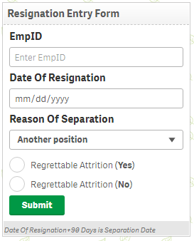
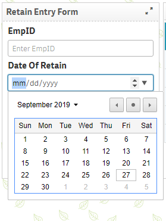

# InputForm
<h3>
Input Form Settings
</h3>
<ul>
	<li>URL : This is the url for the data to be passed</li>
	<li>Request type : Post/Get as per your custom server</li>
	<li>Button Label : Submit button label</li>
	<li>Button Id</li>
	<li>Reload Button : enables reload of app when action is triggered</li>
	<li>Partial Reload : enables <b>partial<b> reload of app when action is triggered</li>
	<li>Reload Option : default mode is recommended</li>
</ul>

<h3>
Form Items
</h3>
<ul>
	<li>Label : label for the input type</li>
	<li>Type : Input type</li>
	<li>If Type is Dropdown : then Add Options button will be visible</li>
	<li>Add Options -> Value : value for option for dropdown</li>
	<li>Value : Add default value</li>
	<li>Id : Input type ID</li>
	<li>Show/Hide : if enabled it will not be visible</li>
	<li>Enable/Disable : if enabled it will be Disabled</li>
</ul>
<h1>Demo</h1>

